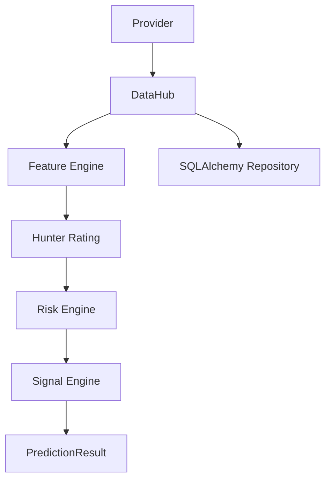

# SportsHunter-AI Architecture

SportsHunter-AI Beta v1 is organized around a single data boundary:
business modules call DataHub, and DataHub calls Provider implementations.

The first release uses SQLite through SQLAlchemy ORM and Alembic migrations.
The database URL is configured by environment variable, so PostgreSQL can be
introduced later without changing business modules.
